<!-- ## Links úteis (Tirar isso aqui depois)

- [Pasta no Drive](https://drive.google.com/drive/folders/1oEhYCcNuu0_TfsNUXb35vzY4aYvZH-lx?usp=drive_link)
- [Quadro no Trello](https://trello.com/b/Jy282Tri/projeto-desenvolvimento-web)
- [Protótipo do Site - Figma](https://www.figma.com/file/kVPAEixF5v37GqPGSb2AkW/Projeto-Site?type=design&node-id=0-1&mode=design&t=ip824XabKOCrZ9v7-0)
- [Plano de Projeto - O que devemos fazer](https://docs.google.com/document/d/1FNTAa6zle-AbHsPCnJMcvanx6jBjKAR6/edit)
- [Plano de Projeto - O que já fizemos](https://docs.google.com/document/d/1gk2ELwdB_5cwH3E8PvqyU_ZSbZPXcxQg/edit?rtpof=true)
- [Planejamento da Disciplina EngSof - versão atualizada](https://docs.google.com/spreadsheets/d/14gF6XqsYz6a20eCrm2Es33_6zG26AHoD4vR-v8Dz8GE/edit#gid=1036714948)
- [Atividades do Projeto de EngSof](https://docs.google.com/spreadsheets/d/1dRVxodQT8VO-5FTN785RePfneY-A9nYlamd3xnK9eUA/edit#gid=1975033013)

<hr> -->

# PET.Amigos - Adoção de Animais

## Índice

- [PET.Amigos - Adoção de Animais](#petamigos---adoção-de-animais)
  - [Índice](#índice)
  - [Sobre o Projeto](#sobre-o-projeto)
  - [Integrantes](#integrantes)
  - [Responsáveis](#responsáveis)
    - [SSC0130 - Engenharia de Software (2024)](#ssc0130---engenharia-de-software-2024)
    - [SCC0219 - Introdução ao Desenvolvimento Web (2024)](#scc0219---introdução-ao-desenvolvimento-web-2024)
  - [Cliente](#cliente)
    - [Identificação do Cliente](#identificação-do-cliente)
    - [Reuniões e Comunicação](#reuniões-e-comunicação)
    - [Feedback e Validação](#feedback-e-validação)
  - [Metodologia Utilizada](#metodologia-utilizada)
    - [Sprints](#sprints)
  - [Ferramentas Utilizadas](#ferramentas-utilizadas)
    - [Engenharia de Software](#engenharia-de-software)
    - [Desenvolvimento Web](#desenvolvimento-web)
  - [Forma de Utilização](#forma-de-utilização)
    - [Requisitos](#requisitos)
    - [Instalação](#instalação)
  - [Overview das Funcionalidades do Sistema](#overview-das-funcionalidades-do-sistema)
  - [Documentação Estendida](#documentação-estendida)
  - [Screenshots da Aplicação](#screenshots-da-aplicação)
    - [Home](#home)
    - [Login / Register](#login--register)
    - [Search](#search)
      - [Não Logado](#não-logado)
      - [Logado como Usuário](#logado-como-usuário)
    - [ONG](#ong)
      - [Não logado](#não-logado-1)
      - [Logado](#logado)
      - [Editar Perfil](#editar-perfil)
      - [Adicionar Pet](#adicionar-pet)
    - [User](#user)
      - [Editar Perfil](#editar-perfil-1)
    - [Pet](#pet)
      - [Visão Usuário](#visão-usuário)
      - [Visão ONG Protetora](#visão-ong-protetora)
      - [Editar Pet](#editar-pet)
  - [Conclusões e Aprendizados](#conclusões-e-aprendizados)

## Sobre o Projeto

Este projeto foi desenvolvido como parte das disciplinas de Engenharia de Software e Introdução ao Desenvolvimento Web. 

O objetivo foi criar um sistema de tema social para um cliente externo à USP. Durante o desenvolvimento, seguimos metodologias ágeis e utilizamos diversas ferramentas para organização e comunicação.

Obtivemos, como resultado final, uma aplicação web completa dedicada à adoção de animais. Esta plataforma permite que usuários e ONGs interajam em um portal onde pets são catalogados, exibidos, e têm a possibilidade de serem adotados e apreciados pelos usuários.

A aplicação não só facilita o processo de adoção, mas também promove a conscientização sobre a causa animal, fornecendo uma interface intuitiva e acessível para todos os envolvidos.

## Integrantes

> Universidade de São Paulo (USP) - Instituto de Ciências Matemáticas e de Computação (ICMC)
> Ciências da Computação - 1º Semestre de 2024

- Artur De Vlieger Lima - [vligmart@usp.br](mailto:vligmart@usp.br)
- Catarina Moreira Lima - [catarina.lima@usp.br](mailto:catarina.lima@usp.br)
- Enzo Nunes Sedenho - [enzosedenho@usp.br](mailto:enzosedenho@usp.br)
- Gabriel da Costa Merlin - [gabrielcmerlin@usp.br](mailto:gabrielcmerlin@usp.br)
- Gustavo Gabriel Ribeiro - [gugagribeiro@usp.br](mailto:gugagribeiro@usp@usp.br)
- Pedro Augusto Monteiro Delgado - [pedro.delgado@usp.br](mailto:pedro.delgado@usp.br)

## Responsáveis


### SSC0130 - Engenharia de Software (2024)

- Rosana Teresinha Vaccare Braga
- Simone do Rocio Senger de Souza

### SCC0219 - Introdução ao Desenvolvimento Web (2024)

- Bruna Carolina Rodrigues da Cunha

## Cliente

### Identificação do Cliente

- **Nome da Cliente**: Tuka Nyko
- **Contatos**:
  - **Email**: [acaochegodatuka@gmail.com](mailto:acaochegodatuka@gmail.com)
  - **Instagram**: [Acãochego Da Tuka](https://www.instagram.com/acaochegodatuka?igsh=MXR5am1wZ2QwZ3Nhbg==)
  - **Facebook**: [Acãochego Da Tuka](https://www.facebook.com/acaochegodatuka/)

### Reuniões e Comunicação

Durante o desenvolvimento do projeto, mantivemos uma comunicação contínua e transparente com o cliente para garantir que suas necessidades e expectativas fossem atendidas. Abaixo estão algumas das atividades realizadas:

- **Reuniões periódicas**: Realizamos reuniões com o cliente via Google Meet onde discutimos o progresso do projeto, coletamos feedback e ajustamos os requisitos conforme necessário.

- **Documentação de Requisitos**: No início do projeto, documentamos detalhadamente os requisitos do cliente, garantindo um entendimento claro e compartilhado das funcionalidades esperadas.

- **Prototipagem e Demonstrações**: Desenvolvemos protótipos e realizamos demonstrações das funcionalidades implementadas para o cliente, permitindo ajustes rápidos e eficazes.

### Feedback e Validação

A participação ativa do cliente foi fundamental para o sucesso do projeto. O feedback contínuo fornecido durante as reuniões e interações nos ajudou a alinhar o desenvolvimento com as expectativas do cliente e a corrigir possíveis desvios antecipadamente.

## Metodologia Utilizada

Adotamos o método ágil Scrum para gerenciar o desenvolvimento do projeto. O trabalho foi dividido em sprints, com revisões regulares e incrementos contínuos do sistema.

### Sprints

- **Sprint 1**: Planejamento, organização do ambiente de desenvolvimento e levantamento de requisitos
- **Sprint 2**: Design do sistema e elaboração dos protótipos de baixa, média e alta fidelidade
- **Sprint 3**: Desenvolvimento do Front-end do MVP, e coleta de feedbacks com a cliente
- **Sprint 4**: Aprimoramento do MVP, desenvolvimento Back-end
- **Sprint 5**: Integração do projeto e realease da versão estável
- **Sprint 6**: Ajustes finais e apresentação à cliente

## Ferramentas Utilizadas

### Engenharia de Software

- **Trello**: Para organização das tarefas e documentação do andamento do projeto.
- **Figma**: Para elaboração dos protótipos de baixa e média fidelidade.
- **Discord**: Para comunicação diária e interação com os responsáveis.
- **GitHub/Google Drive**: Para armazenamento dos entregáveis e controle de versões.
- **Google Meet**: Para reuniões periódicas com a cliente.

### Desenvolvimento Web

- Front-End: HTML, CSS, JavaScript
  - Frameworks: Bootstrap
- Back-End: Node.js
  - Frameworks: Express.js
  - Banco de Dados: PostgreSQL
- Integração: API RESTful para comunicação entre front-end e back-end.

## Forma de Utilização

### Requisitos

- Serviço de armazenamento de dados remoto (Neon) ou local com suporte para PostgreSQL
- Serviço de armazenamento de fotos remoto (Minio)
- Navegador Web (Google Chrome, Mozilla Firefox, etc.)
- Acesso à internet

### Instalação

1. Clone este repositório:

   ```bash
   git clone https://github.com/usuario/repo.git
   ```

2. Crie um arquivo `.env`e configure as variáveis do ambiente pelo arquivo:

    ```bash
    # O endereço do host do banco de dados PostgreSQL, indicando onde o banco de dados está sendo executado.
    PGHOST='endereco_host' 

    # O nome do banco de dados ao qual você deseja se conectar.
    PGDATABASE='name_host'

    # O nome de usuário utilizado para autenticar a conexão com o banco de dados.
    PGUSER='name_user'

    # A senha associada ao nome de usuário especificado em PGUSER.
    PGPASSWORD='password_user'

    # A chave de acesso para o serviço de armazenamento de fotos remoto (Minio).
    ACCESS_KEY ='acess_key'

    # A chave secreta que funciona em conjunto com a ACCESS_KEY para fornecer acesso seguro ao serviço.
    SECRET_KEY ='secret_key'

    # Segredo utilizado para fins de autenticação (geração de tokens JWT).
    AUTH_SECRET ='auth_key'
    ```

3. Navegue até o diretório onde estão os códigos do projeto:

   ```bash
   cd code
   ```

4. Instale todas as dependências para o projeto:

    ```bash
    npm install
    ```

5. Inicie a aplicação:

    ```bash
    node app.js
    ```

A aplicação será iniciada e poderá ser acessada acessando o endereço `http://localhost:3000/`

## Overview das Funcionalidades do Sistema

- Cadastro de Usuários
  - Permite que novos usuários se cadastrem no sistema, fornecendo informações como nome, email, senha, entre outros detalhes pessoais.

- Cadastro de Pets
  - ONGs podem cadastrar novos animais disponíveis para adoção, incluindo detalhes como nome, idade, raça, tamanho, sexo, fotos e comentários adicionais.

- Upload de Fotos
  - Possibilita o upload de imagens dos animais pelas ONGs, melhorando a apresentação dos pets no sistema.

- Perfil do Usuário
  - Os usuários podem gerenciar e atualizar suas informações pessoais, incluindo preferências e dados de contato.

- Perfil da ONG
  - As ONGs podem gerenciar suas informações e os animais que estão sob sua responsabilidade, incluindo a atualização de dados dos pets e informações de contato da ONG.

- Curtir Pets
  - Permite que os usuários curtam os perfis de pets que estão interessados, salvando esses pets em uma lista dentro de seus perfis para possível visualização posterior

- Processo de Adoção
  - Facilita a comunicação entre usuários interessados e ONGs para iniciar o processo de adoção de um animal.

- Listagem de Pets
  - Permite que os usuários visualizem a lista de animais disponíveis para adoção

- Sistema de Busca
  - Permite aos usuários realizar buscas específicas por animais, utilizando critérios como espécie, raça, tamanho, porte e temperamento.

- Autenticação
  - Garante que somente usuários registrados possam acessar certas funcionalidades, utilizando login e senha para verificação.

## Documentação Estendida

Diversos documentos foram desenvolvidos para o alinhamento com as necessidades da Engenharia de Software ao longo do projeto. Acesse abaixo para mais detalhes:

- [Plano de Projeto](https://github.com/GustavoZiel/Projeto-Desenvolvimento-Web/tree/main/docs/planodeprojeto): Detalhes sobre o planejamento e execução do projeto.
- [Requisitos](https://github.com/GustavoZiel/Projeto-Desenvolvimento-Web/tree/main/docs/requisitos): Especificações funcionais e não funcionais do sistema.
- [Protótipos](https://github.com/GustavoZiel/Projeto-Desenvolvimento-Web/tree/main/docs/prototipos): Design visual e interativo inicial do sistema.
- [Modelagem](https://github.com/GustavoZiel/Projeto-Desenvolvimento-Web/tree/main/docs/modelagem): Diagramas e modelos que representam a estrutura do sistema.
- [Casos de Uso](https://github.com/GustavoZiel/Projeto-Desenvolvimento-Web/tree/main/docs/casosdeuso): Descrição detalhada de como os usuários interagem com o sistema.
- [Casos de Teste](https://github.com/GustavoZiel/Projeto-Desenvolvimento-Web/tree/main/docs/casosdeteste): Conjunto de cenários e procedimentos para testar o sistema.

## Screenshots da Aplicação

### Home

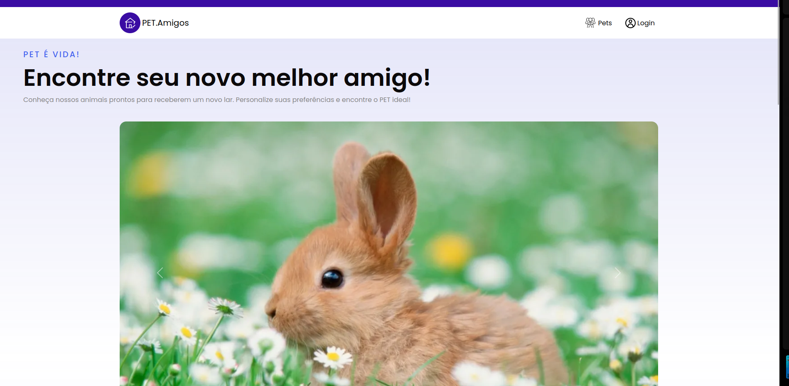

### Login / Register


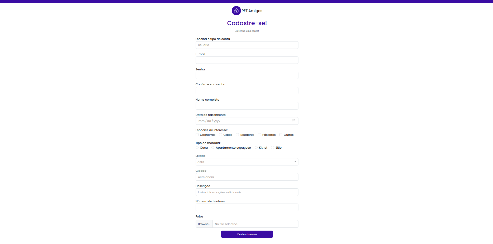

### Search

#### Não Logado

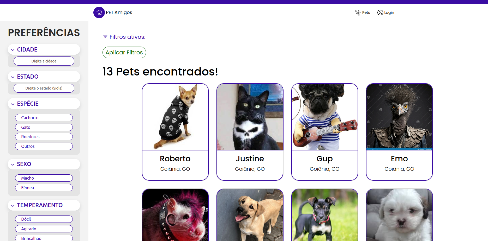

#### Logado como Usuário

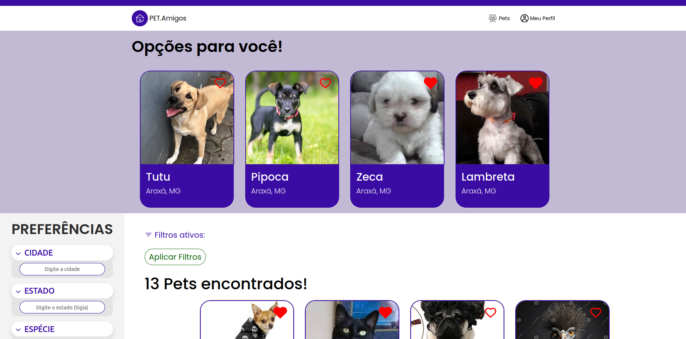

### ONG

#### Não logado

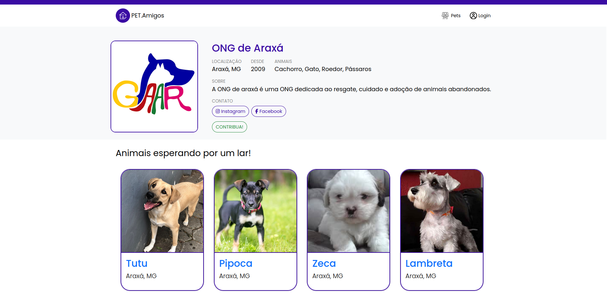

#### Logado

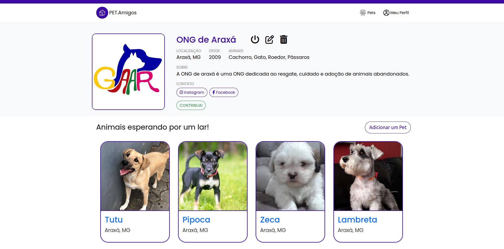

#### Editar Perfil

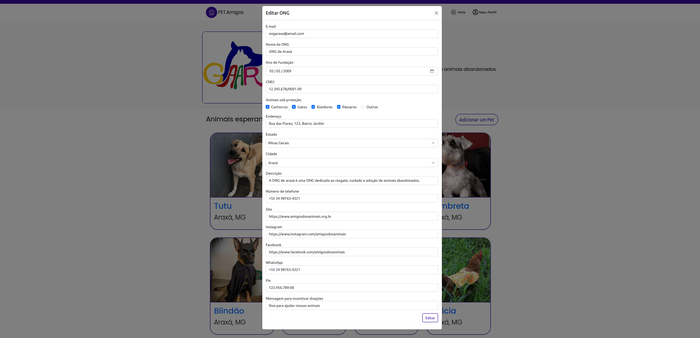

#### Adicionar Pet

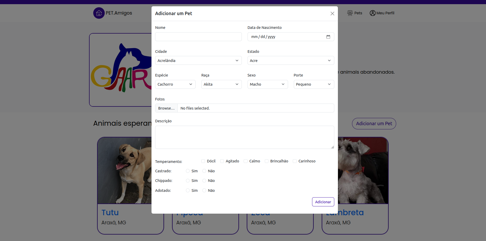

### User

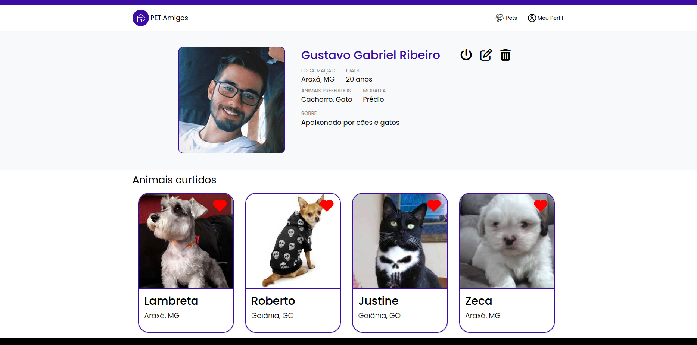

#### Editar Perfil

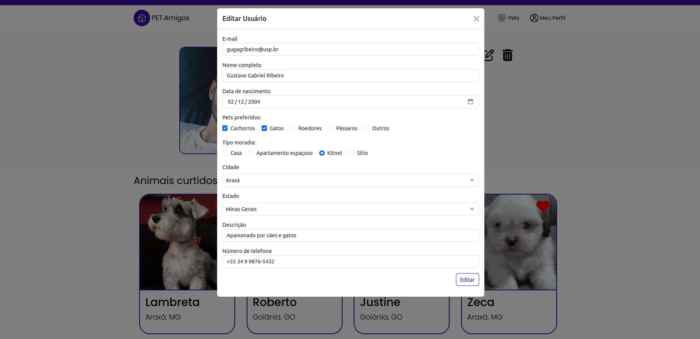

### Pet

#### Visão Usuário

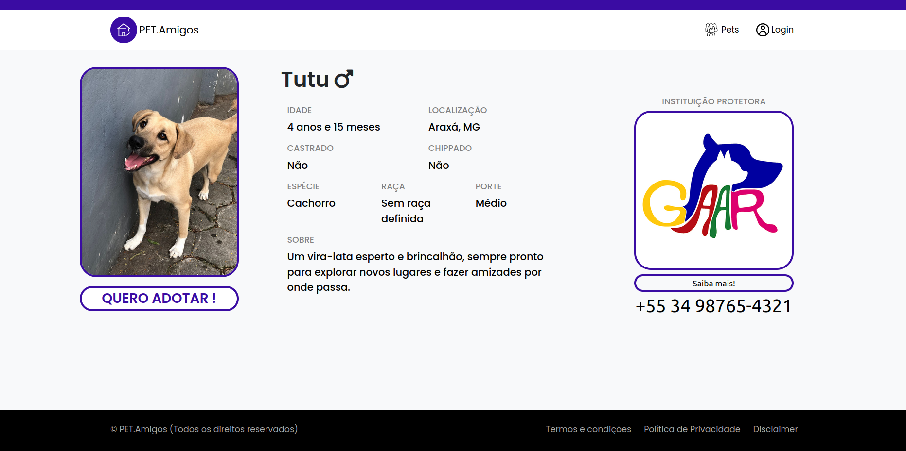

#### Visão ONG Protetora

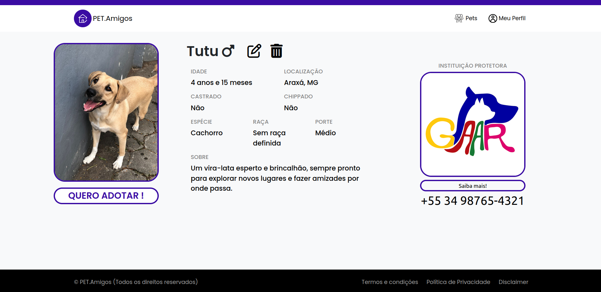

#### Editar Pet


## Conclusões e Aprendizados

Através deste projeto, colocamos em prática diversas técnicas de engenharia de software, desde as primeiras entrevistas com o cliente para obter requisitos, estórias e funcionalidades do sistema, até a distribuição de tarefas em sprints conforme a metodologia ágil. Experiênciamos diretamente como uma organização eficiente e comunicação eficaz entre os membros da equipe são essenciais para o sucesso a longo prazo do projeto.

Desenvolvemos uma aplicação web totalmente funcional dedicada a uma causa social importante, explorando tanto o desenvolvimento backend quanto frontend com ferramentas diversas e interessantes. Esta experiência nos permitiu não apenas expandir nossos conhecimentos técnicos, mas também aprimorar nossas habilidades colaborativas.

Agradecemos às professoras responsáveis por essa oportunidade, e pelas aulas e conhecimentos adquiridos.
